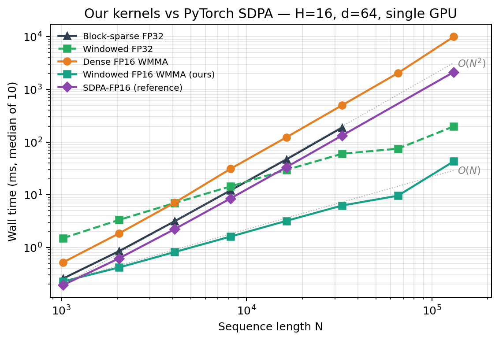
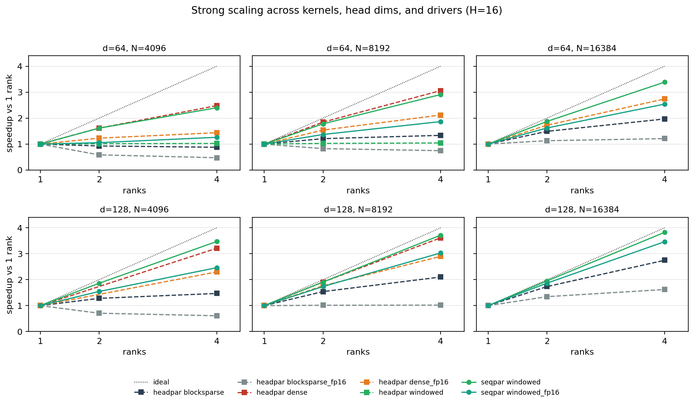

# Long-Context Attention: Dense, Windowed, and Block-Sparse CUDA Kernels

Hand-written FlashAttention-style CUDA attention kernels for long sequences, scaled across four GPUs with MPI. At a sequence length of 32K tokens, the sliding-window tensor-core kernel runs **21.3x faster than PyTorch's `scaled_dot_product_attention`** in FP16; at 131,072 tokens it runs **49.5x faster** — 42.9 ms against 2123 ms, measured rather than extrapolated.

The project exists to answer one question: **at what sequence length does structured sparsity beat a well-optimized dense kernel, and how does either compare against a production implementation?** Six kernels (three sparsity patterns x FP32/FP16) and two MPI decompositions were built to find out.

**[Full technical report (10 pages, PDF)](CME213_Final_Report.pdf)**

## Results

### Against PyTorch SDPA-FP16, single GPU

Our windowed FP16 WMMA kernel versus PyTorch's FP16 SDPA at matching shapes (`H=16`, `d=64`, `w=256`):

| sequence length | speedup over SDPA-FP16 |
|---|---|
| 1K – 2K | crossover |
| 4K | 2.7x |
| 8K | 5.3x |
| 16K | 10.4x |
| 32K | **21.3x** |
| 128K | **49.5x** (42.9 ms vs 2123 ms) |

The asymptotics behind it, measured as log-log slopes: 1.95 for dense (`O(N^2)`), **1.05 for windowed** (`O(N)`), 1.89 for block-sparse at `rho=0.1`. Against our own dense kernel, windowed is 18x faster at N=16K and 36x at N=32K. SDPA-FP16 stays roughly 3x ahead of our *dense* FP16 kernel — the gap is warp-specialized softmax, which we did not reproduce — so the win here is algorithmic, not a claim of out-engineering PyTorch.



### Multi-GPU scaling

| result | number |
|---|---|
| Sequence-parallel windowed FP32, `d=128`, N=16K, P=4 | **96% efficiency** (87% in FP16) |
| Head-parallel dense FP32, `d=128`, N=8K, P=4 | 90% efficiency |
| Head-parallel windowed FP32, N=4096, P=4 | 1.02x (26%) — communication wall |
| Switching windowed from head- to sequence-parallel at P=4, N=4096 | 7.26 ms to 1.92 ms (**3.8x**) |

The last row is the central multi-GPU result. Head-parallel communication is `O(N H d / P)` and swamps the cheap windowed kernel; sequence-parallel halo exchange is `O(w H d)` — independent of N — so it keeps scaling. Measured communication time dropped 3.3x (5.06 ms to 1.53 ms) against a model that predicted 24x, the gap being small-message latency rather than bandwidth.

Isoefficiency behaves as predicted: sequence-parallel WMMA windowed efficiency rises 32% to 47% to 64% as N grows 4K to 8K to 16K, tracking the `W ~ N ~ P` curve.



### Optimization lifts, single GPU

Profiling with Nsight Compute flagged 88% wasted memory sectors and a 254-register-per-thread footprint. Two compounding fixes — `float4` cooperative tile loads (512 B per warp instruction) and a chunked online softmax (4 chunks of 16 columns) — gave 1.45x on dense, 1.38x on windowed, and 1.50x on block-sparse at N=4096.

That left FP32 CUDA-core throughput as the ceiling, not bandwidth: all three kernels sit deep to the right of the roofline ridge at 13.4% / 7.5% / 13.4% of the 16.3 TFLOPS FP32 peak, register-limited to about 25% occupancy. Tensor cores were the only way past it. Adding WMMA paths bought a further **4.47x on dense, 6.65–9.61x on windowed, and 4.30x on block-sparse**, reaching 9.7–10.5 TFLOPS — 7.5–8.1% of the 130 TFLOPS FP16 tensor-core peak.

Non-blocking halo overlap in the sequence-parallel driver was the smallest win: 1.19x at N=4K, fading to 1.01x at N=16K as compute grows relative to communication.

### At the layer level

A kernel-only speedup is easy to oversell, so the kernels were exposed to PyTorch through an `extern "C"` ctypes shim and benchmarked inside a full transformer-style layer (three FP16 `nn.Linear` projections around the attention call). The crossover sits at N ~ 8K for both `d=64` and `d=128`, and past it the layer is **5.2x faster at N=32K, `d=64`** and 2.1x at N=16K, `d=128`. The drop from 21x to 5.2x is entirely projection overhead.

## What's implemented

All six kernels share a single FlashAttention-style skeleton — fused tiled loop, register-resident per-row online softmax with no inter-thread reduction, `float4` cooperative tile loads, shared memory padded against bank conflicts — and **differ only in which K/V tiles each query block streams**:

| pattern | FP32 | FP16 (WMMA) | K/V iterator |
|---|---|---|---|
| Dense (exact) | `src/kernels/dense.cu` | `dense_fp16.cu` | every tile |
| Sliding window | `windowed.cu` | `windowed_fp16.cu` | tiles intersecting `[i-w, i+w]`, plus `G` global tokens |
| Block-sparse | `blocksparse.cu` | `blocksparse_fp16.cu` | active block-columns from a CSR `row_ptr`/`col_idx` |

Holding the skeleton fixed is deliberate: it makes the comparison measure the sparsity pattern rather than differences in implementation quality.

Two MPI decompositions, both passing device pointers straight to CUDA-aware MPI:

- **Head-parallel** (`src/mpi/head_parallel.cu`) — three `MPI_Scatter` for Q/K/V plus one `MPI_Gather` for O; kernel-agnostic, needs `H % P == 0`. Output is bit-identical across rank counts.
- **Sequence-parallel windowed** (`src/mpi/seq_parallel.cu`) — each rank owns a row stripe plus `w`-row K/V halos, exchanged with four `MPI_Sendrecv` per iteration, halo edges packed with `cudaMemcpy2D`. Includes a non-blocking variant that overlaps the interior kernel with the exchange, plus global-key broadcast and a global-query second pass for Longformer semantics.

Also: causal variants of all three patterns, `d=128` support throughout, and `attn_capi.cu` / `libattn.so` for calling the kernels from PyTorch.

## Correctness

Every kernel is checked against a NumPy reference over a ladder of N values plus deliberate edge cases:

| kernel | max absolute error | cases |
|---|---|---|
| dense FP32 | 4.2e-7 – 6.0e-7 | 4, including causal |
| windowed FP32 | 3.3e-7 – 9.2e-7 | 6, including `w >= N`, `w = 0`, `G > 0`, causal |
| block-sparse FP32 | reproduces dense at FP32 epsilon when `rho = 1.0` | random masks at several densities |
| FP16 WMMA paths | ~1e-4 | tolerance 1e-3 |

Head-parallel MPI output is **bit-identical** for P in {1, 2, 4}. Sequence-parallel differs by ~7.7e-7, from tile-boundary reassociation in the online softmax — expected, and bounded.

## Two findings that mattered more than the speedup

**The memory hypothesis was wrong.** We expected sparse kernels to cut peak memory as well as time. They do not: dense, windowed, and block-sparse land within 1% of each other at every N (514 / 514 / 516 MB at N=32K). A FlashAttention-style kernel never materializes the `N x N` score matrix in the first place, so the `4NHd` footprint of Q, K, V, O dominates the CSR indirection entirely. Sparsity buys time, not space. This is reported as a refuted hypothesis rather than quietly dropped.

**Sparsity without structure is worthless.** Measuring relative L2 error against a dense reference across three synthetic input regimes: windowed at `w=64` reaches L2 = 0.05 on locally-correlated inputs (0.025 at `w=256`), but saturates near 0.9 when the signal lives in planted long-range pairs that no local window can see. Random block-sparse masks are useless in every regime — L2 ~ 1 on locally-correlated inputs, ~ 3 on uniform — even at `rho = 0.5`. So the speedups above presuppose locality in the data. A designed Longformer-style local-plus-global mask would close the gap, and the CSR kernel accepts one as a drop-in.

## Hardware and methodology

- **4 x NVIDIA Quadro RTX 6000** (Turing, 24 GB) on a single node, Stanford ICME `gpu-turing` partition
- Peaks: 16.3 TFLOPS FP32, 130 TFLOPS FP16 tensor core, 624 GB/s DRAM, giving a roofline ridge at ~26 FLOP/byte
- Defaults: `H=16`, `d=64` (and 128), `w=256`, `G=8`, `rho=0.10`, block size 64, tiles `B_r = B_c = 64` (32 at `d=128`)
- Timing: CUDA events, median of 10 measured iterations after 5 warmups; min-max spread typically under 1% and never above 5%. MPI loops are bracketed with a barrier and timed with `MPI_Wtime`. Peak device memory from `cudaMemGetInfo`.
- Baseline: **PyTorch 2.5.1** SDPA, FP32 math backend and FP16 memory-efficient backend. FlashAttention-2 requires Ampere or newer, so FA-2 could not be benchmarked on Turing.

## Build

Requirements: CUDA 11+ (`nvcc`); CUDA-aware MPI for the multi-GPU drivers (OpenMPI 4 with HPC-X, or the NVIDIA HPC SDK — device pointers go straight into the collectives); a GPU of compute capability sm_70+, sm_75+ for the WMMA paths. The kernels are hand-rolled — no cuBLAS, cuDNN, or cuSPARSE. Python 3.9+ with numpy, pandas, torch >= 2.0, pyyaml, and matplotlib is needed only for the benchmark and plotting scripts.

```bash
make all      SM_ARCH=sm_75   # attn CLI + the three test binaries
make mpi      SM_ARCH=sm_75   # head-parallel and sequence-parallel MPI drivers
make attn-lib SM_ARCH=sm_75   # libattn.so, for the PyTorch/ctypes path
make test     SM_ARCH=sm_75   # build and run the unit tests
```

`SM_ARCH` defaults to `sm_80` in the Makefile; every result in this repo was collected at **`sm_75`** (Turing). Set it to match your GPU — `sm_75` Turing, `sm_80` A100, `sm_89` L40S, `sm_90` H100/H200. Binaries land in `build/`.

## Run

Single GPU. Every flag is `--name=value`; the CLI prints one CSV line with median/min/max milliseconds and peak megabytes.

```bash
build/attn --kernel=dense         --N=4096 --d=64 --H=16 --warmup=5 --iters=10
build/attn --kernel=windowed      --N=4096 --d=64 --H=16 --w=256 --G=8
build/attn --kernel=blocksparse   --N=4096 --d=64 --H=16 --B=64 --rho=0.10
build/attn --kernel=windowed_fp16 --N=4096 --d=64 --H=16 --w=256
build/attn --kernel=windowed      --N=4096 --d=64 --H=16 --w=256 --causal=1
```

`--kernel` takes `dense`, `windowed`, or `blocksparse`, each with a `_fp16` tensor-core variant. Other flags: `--mask=random|window` (block-sparse pattern), `--seed`, `--in`/`--out` for binary Q/K/V and O.

Multiple GPUs:

```bash
mpirun -np 4 build/attn_mpi_headpar --kernel=windowed --N=4096 --w=256 --H=16
mpirun -np 4 build/attn_mpi_seqpar  --kernel=windowed --N=4096 --w=256 --H=16 --overlap=1
```

Benchmark sweeps, which drive the binaries above and write CSVs into `report/data/`:

```bash
python bench/final_crossover.py          # three-kernel crossover, N = 1K..32K
python bench/sdpa_baseline.py            # PyTorch SDPA at matching shapes
python bench/approx_quality.py           # approximation quality over w and rho
python bench/end_to_end.py               # full transformer-layer timing (needs libattn.so)
python bench/validate.py --kernel dense  # numerical validation against NumPy
```

Every figure in the report can be regenerated from the CSVs already committed here — no GPU required:

```bash
python analysis/plot_dense_vs_sdpa.py
python analysis/plot_strong_scaling_full.py
python analysis/plot_roofline_post.py
python analysis/plot_final_crossover.py
python analysis/plot_approx_quality.py
python analysis/plot_end_to_end.py
```

The SLURM scripts in `slurms/` are the exact jobs used to collect the data, on the Stanford ICME `gpu-turing` partition; their raw output is kept in `slurms/logs/` for provenance.

## Layout

```
src/
  kernels/   six single-GPU kernels: dense, windowed, blocksparse x FP32/FP16 WMMA
  mpi/       head-parallel and sequence-parallel multi-GPU drivers
  cli/       attn host driver, plus the extern "C" shim for PyTorch interop
  common/    kernel dispatch, BlockCSR mask construction, utility headers
tests/       CUDA unit tests against a host reference
bench/       Python harnesses: sweeps, SDPA baseline, validation, layer timing
analysis/    plotting scripts that turn the benchmark CSVs into the report figures
report/
  data/      every CSV and raw measurement behind the report
  figures/   the generated figures
slurms/      the SLURM jobs used to collect the data, and their logs
configs/     benchmark configuration
scripts/     build and smoke-test wrappers
Makefile
```

## Limitations

- Forward pass only; no backward pass.
- No warp-specialized softmax — this is precisely the residual ~3x gap between our dense FP16 kernel and SDPA-FP16.
- Single node. Across nodes, point-to-point latency would grow, though the halo-locality argument for sequence-parallelism still holds.
- FlashAttention-2 needs Ampere or newer, so it could not be benchmarked as a baseline on Turing.

Natural next steps: layer the windowed iterator on an FA-2 backbone to compound the algorithmic and implementation wins, and check whether the windowed approximation error actually costs anything in LLM training.

## About

Final project for **Stanford CME 213, Parallel Computing with CUDA, MPI and OpenMP** (Spring 2026), by **Emma Sampietro** and **Arturo Favara**. The full analysis — performance model, roofline study, Amdahl and isoefficiency treatment, and appendices — is in [CME213_Final_Report.pdf](CME213_Final_Report.pdf).
